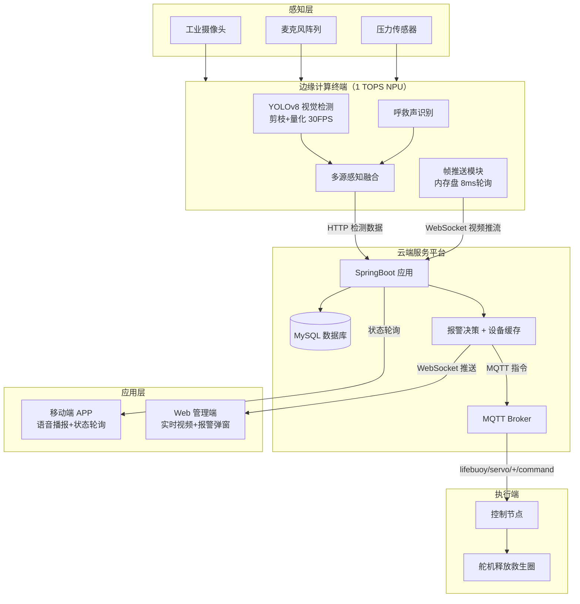
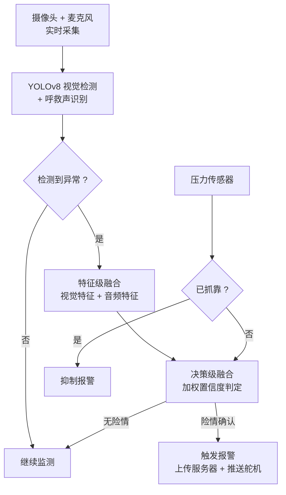
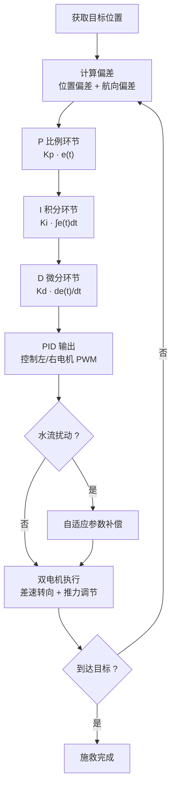
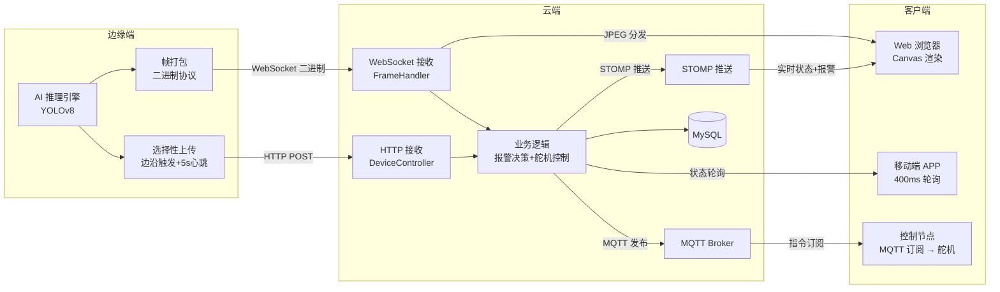

# 智能救生圈系统 — 竞赛文档流程图

VS Code 按 `Ctrl+Shift+V` 预览，右键图表 → 复制图片 → 粘贴到 Word。

---

## 图3.1 — 系统技术路线总览示意图

```mermaid
flowchart TB
    subgraph 感知层["感知层"]
        A1["工业摄像头"]
        A2["麦克风阵列"]
        A3["压力传感器"]
    end

    subgraph 边缘端["边缘计算终端（1 TOPS NPU）"]
        B1["YOLOv8 视觉检测<br/>剪枝+量化 30FPS"]
        B2["呼救声识别"]
        B3["多源感知融合"]
        B4["帧推送模块<br/>内存盘 8ms轮询"]
    end

    subgraph 云端["云端服务平台"]
        C1["SpringBoot 应用"]
        C2["报警决策 + 设备缓存"]
        C3["MQTT Broker"]
        C4[("MySQL 数据库")]
    end

    subgraph 执行端["执行端"]
        D1["控制节点"]
        D2["舵机释放救生圈"]
    end

    subgraph 应用层["应用层"]
        E1["Web 管理端<br/>实时视频+报警弹窗"]
        E2["移动端 APP<br/>语音播报+状态轮询"]
    end

    A1 & A2 & A3 --> 边缘端
    B1 & B2 --> B3
    B4 -->|"WebSocket 视频推流"| C1
    B3 -->|"HTTP 检测数据"| C1
    C1 --> C2
    C2 -->|"MQTT 指令"| C3
    C3 -->|"lifebuoy/servo/+/command"| D1
    D1 --> D2
    C2 -->|"WebSocket 推送"| E1
    C1 -->|"状态轮询"| E2
    C1 --> C4
```

---

## 图3.2 — 多模态感知流程图

```mermaid
flowchart TD
    A["摄像头 + 麦克风<br/>实时采集"] --> B["YOLOv8 视觉检测<br/>+ 呼救声识别"]
    B --> C{"检测到异常 ?"}
    C -->|"否"| N["继续监测"]
    C -->|"是"| D["特征级融合<br/>视觉特征 + 音频特征"]
    D --> E["决策级融合<br/>加权置信度判定"]
    F["压力传感器"] --> G{"已抓靠 ?"}
    G -->|"是"| S["抑制报警"]
    G -->|"否"| E
    E -->|"险情确认"| H["触发报警<br/>上传服务器 + 推送舵机"]
    E -->|"无险情"| N
```

---

## 图3.3 — PID 闭环控制算法流程图

```mermaid
flowchart TD
    A["获取目标位置"] --> B["计算偏差<br/>位置偏差 + 航向偏差"]
    B --> C["P 比例环节<br/>Kp · e(t)"]
    C --> D["I 积分环节<br/>Ki · ∫e(t)dt"]
    D --> E["D 微分环节<br/>Kd · de(t)/dt"]
    E --> F["PID 输出<br/>控制左/右电机 PWM"]
    F --> G{"水流扰动 ?"}
    G -->|"是"| H["自适应参数补偿"]
    G -->|"否"| I["双电机执行<br/>差速转向 + 推力调节"]
    H --> I
    I --> J{"到达目标 ?"}
    J -->|"否"| B
    J -->|"是"| K["施救完成"]
```

---

## 图3.4 — 系统数据流图

```mermaid
flowchart LR
    subgraph 边缘端["边缘端"]
        E1["AI 推理引擎<br/>YOLOv8"]
        E2["帧打包<br/>二进制协议"]
        E3["选择性上传<br/>边沿触发+5s心跳"]
    end

    subgraph 云端["云端"]
        C1["HTTP 接收<br/>DeviceController"]
        C2["WebSocket 接收<br/>FrameHandler"]
        C3["业务逻辑<br/>报警决策+舵机控制"]
        C4["MQTT Broker"]
        C5["STOMP 推送"]
        C6[("MySQL")]
    end

    subgraph 客户端["客户端"]
        L1["Web 浏览器<br/>Canvas 渲染"]
        L2["移动端 APP<br/>400ms 轮询"]
        L3["控制节点<br/>MQTT 订阅 → 舵机"]
    end

    E1 --> E2
    E1 --> E3
    E3 -->|"HTTP POST"| C1
    E2 -->|"WebSocket 二进制"| C2
    C1 & C2 --> C3
    C3 -->|"MQTT 发布"| C4
    C3 -->|"STOMP 推送"| C5
    C3 --> C6
    C4 -->|"指令订阅"| L3
    C5 -->|"实时状态+报警"| L1
    C2 -->|"JPEG 分发"| L1
    C3 -->|"状态轮询"| L2
```
